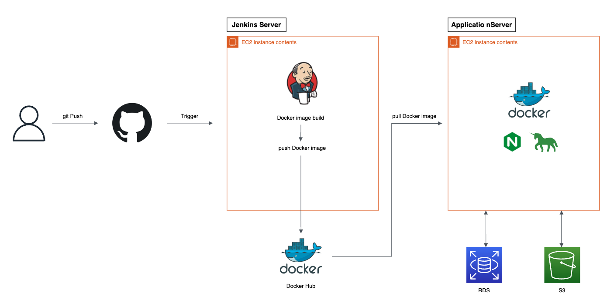

 

> 이전 회사에는 CI/CD 파이프라인이 구축되어 있지 않아 배포 스트레스가 있었다. 
> 개인 프로젝트에서는 자동 배포를 하고 싶어서 CI/CD을 구축하고 있는데
> `Jenkins` & `Django` & `Nginx` & `gunicorn` & `Docker` 관련 자료가 너무 없어서 정리한다.
> 
> ( 다시 할 때 기억 안 나서 울고 있는 나를 위해.. 😥🤐 )

 

# Contents
- [1. 구조 및 설명](#1-구조-및-설명)
- [2. EC2로 Jenkins Server 시작하기](#2-ec2로-jenkins-server-시작하기)
- [3. Jenkins 설정하기](#3-jenkins-설정하기)
- [4. github repo와 Jenkins 연결하기](#4-github-repo와-jenkins-연결하기)
- [5. Docker build & push 스크립트 작성하기](#5-docker-build--push-스크립트-작성하기)

 
 

# 1. 구조 및 설명
`Jenkins를` 이용하여 CI/CD 파이프라인을 구축하는데 여러 방법이 있었다. 
`Jenkinsfile`로 **node**를 설정하여 각 단계에서 해야 할 일을 상세하게 지정하는 방법이 있지만, 
우선은 `Jenkins` **GUI**를 사용하여 구축하려고 한다.

이후 **Jenkinsfile**를 작성 할 예정이다.

## 구조

## 설명
### 1. git Push
- 특정 브랜치에 코드를 푸쉬하거나 브랜치가 merge가 될 때

### 2. Trigger
- `github` `Webhook`을 통해 Jenkins job이 실행

### 3. [Jenkins Server] Docker build image
- trigger을 유발한 코드를 기준으로 도커 이미지를 생성

### 4. [Jenkins Server] Docker push image
- 빌드한 이미지를 도커 허브에 올린다.

### 5. [Application Server] Docker pull image
- 도커 허브에서 빌드한 이미지를 받는다.

### 6. [Application Server] Docker compose Nginx & Gunicorn
- 도커 허브에서 받은 이미지와 웹서버(Nginx & Gunicorn) 연결

### 7. [Application Server] - [RDS] - [S3]
- 웹서버를 실행하고 `RDS`, `S3`와 서비스 시작

 
 

# 2. EC2로 Jenkins Server 시작하기

 
 

# 3. Jenkins 설정하기

 
 

# 4. github repo와 Jenkins 연결하기

 
 

# 5. Docker build & push 스크립트 작성하기

 
 

여기까지가 CI 단계에 해당하는 부분이다. CD는 다음 포스팅에서

