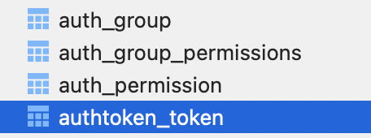
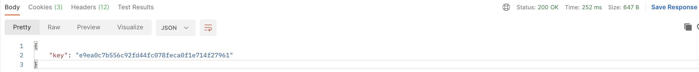
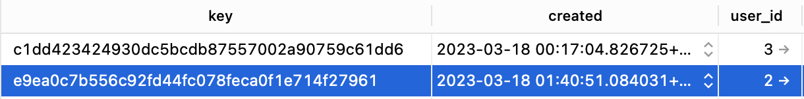

<br>

> `simplejwt`를 적용하다가 `{"key" : " "}` 가 왜 나오는 지 찾다가 정리하는 DRF 인증 포스팅...🦜

<br>

# Contents
- [1. dj-rest-auth의 기본 인증](#1-dj-rest-auth의-기본-인증)
- [2. TokenAuthentication](#2-tokenauthentication)
  - [TOKEN_MODEL](#tokenmodel)
  - [dj-rest-auth : LoginView](#dj-rest-auth--loginview)

<br>
<br>

# 1. dj-rest-auth의 기본 인증
- 기본적으로 dj-rest-auth는 Django의 토큰 기반 인증을 사용하고 있다.
- dj-rest-auth 설치 후 `Installed_Apps`에 추가하는 앱 중 `rest_framework.authtoken`를 통해 확인할 수 있다.
- dj-rest-auth의 기본 인증으로 `JWT`를 사용하고 싶다면, `djangorestframework-simplejwt` 패키지 설치해야 한다. [(👮 _다음 포스팅_ )](https://soojiinleee.github.io/Django/drf-authentication(02)-dj-rest-auth-&-jwt/)

### 참고
- [DRF- dj-rest-auth](https://www.django-rest-framework.org/api-guide/authentication/#django-rest-auth-dj-rest-auth)
- [dj-rest-auth 공식문서](https://dj-rest-auth.readthedocs.io/en/latest/index.html)

<br>
<br>

# 2. TokenAuthentication
## TOKEN_MODEL
- `dj-rest-auth`의 기본 설정을 보면 `rest_framework.authtoken` 의 Token 모델을 사용하는 것을 알 수 있다.
    ```python
    REST_AUTH = {
        ...,
        'TOKEN_MODEL': 'rest_framework.authtoken.models.Token',
    }
    ```
- `rest_framework.authtoken` 앱을 추가하고 `migrate`를 하면 `DB`에 `authtoken_token` 테이블이 생성된다.
  
<br>

- 로그인 성공 시 토큰이 발행되고, 
  
<br>

- `authtoken_token`에 유저 id와 발행된 토큰이 key로 저장된다.
  

<br>

## dj-rest-auth : LoginView
- 인증 유형(`JWT`/`TOKEN`/`SESSION`)에 따라 다르게 처리 되어 있다.
- `dj-rest-auth`의 기본 설정에 인증 유형에 따른 `serializer` 처리도 되어 있고 커스텀도 가능하다.
    ```python
    REST_AUTH = {
        ...,
        'TOKEN_SERIALIZER': 'dj_rest_auth.serializers.TokenSerializer',
        'JWT_SERIALIZER': 'dj_rest_auth.serializers.JWTSerializer'
    }
    ```
- 구체적으로 어떻게 동작하는 지 확인하고 싶을 때는 **무조건** 코드 확인

### 참고
- [dj-rest-auth : Configuration](https://dj-rest-auth.readthedocs.io/en/latest/configuration.html#configuration)
- [DRF-TokenAuthentication](https://www.django-rest-framework.org/api-guide/authentication/#tokenauthentication)
- [dj-rest-auth github: LoginView](https://github.com/iMerica/dj-rest-auth/blob/master/dj_rest_auth/views.py)
