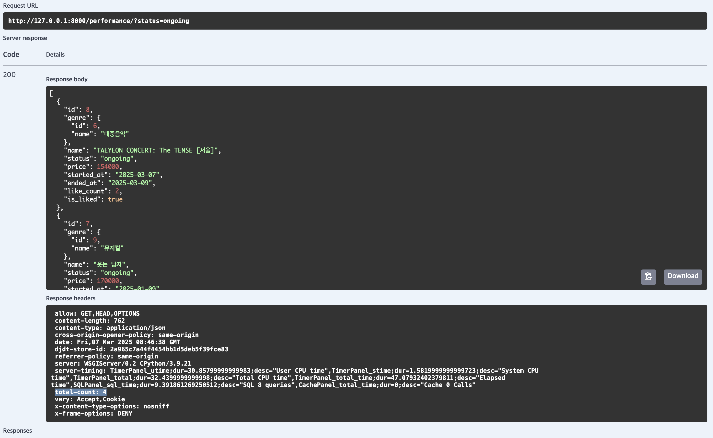
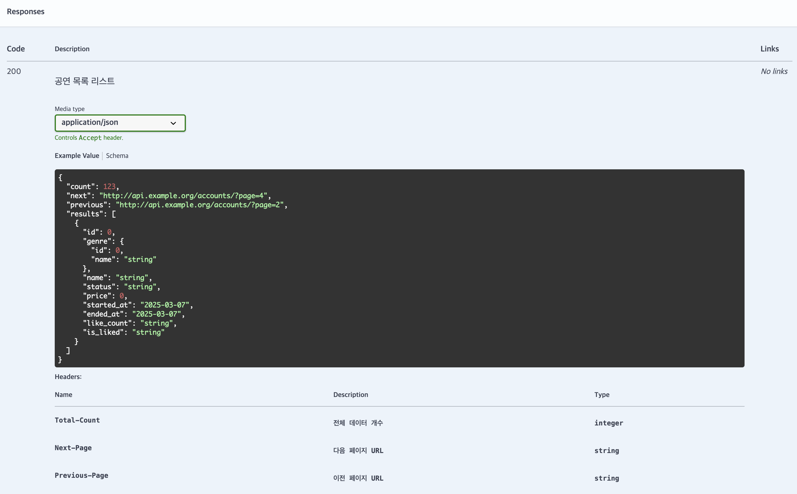

> `drf-spectacular`를 이용했습니다 🙃

# Contents
- `schemas` 모듈로 분리
- `response`에 custom header 추가하기


# 🔷 schemas 모듈로 분리

`views.py` 파일에 `swagger` 내용이 많아서 코드 가독성이 안 좋다. \
`schemas.py` 모듈로 swagger에 들어갈 내용은 옮기는 게 좋은 거 같다 🙃

### 모듈 분리 전

`views.py` : 공연 목록 조회

```python
from drf_spectacular.utils import OpenApiExample, OpenApiParameter, extend_schema_view
from drf_spectacular.utils import extend_schema

class PerformanceViewSet(mixins.ListModelMixin,
                         mixins.RetrieveModelMixin,
                         viewsets.GenericViewSet):
    """공연 리스트 및 상세 조회 API"""
    serializer_class = PerformanceSerializer
    pagination_class = StandardResultsSetPagination

    def get_queryset(self):
        queryset = Performance.objects.select_related('genre').prefetch_related('liked_users').all()
        genre_id = self.request.query_params.get('genre_id', None)
        status = self.request.query_params.get('status', None)

        if genre_id:
            queryset = queryset.filter(genre__id=genre_id)
        if status:
            queryset = queryset.filter(status=status)
        return queryset

    @extend_schema(
        tags=['공연'],
        summary="공연 목록 조회",
        parameters=[
            OpenApiParameter(name="genre_id", description="공연 장르 id", required=False, type=int),
            OpenApiParameter(
                name="status",
                type=str,
                enum=PerformanceStatus.values(),
                description="공연 상태",
                examples=[
                    OpenApiExample("공연 예정",value="upcoming"),
                    OpenApiExample("공연 중", value="ongoing"),
                    OpenApiExample("공연 종료",value="ended"),
                ],
            ),
        ],
    )
    def list(self, request, *args, **kwargs):
        return super().list(request, *args, **kwargs)
```

### 모듈 분리 후

1. `schemas.py` 모듈 추가
    
 ```python
 from drf_spectacular.utils import OpenApiExample, OpenApiParameter, extend_schema_view
 from drf_spectacular.utils import extend_schema
 
 from .models import PerformanceStatus
 
 PERFORMANCE_LIST_SCHEMA = extend_schema(
         tags=['공연'],
         summary="공연 목록 조회",
         parameters=[
             OpenApiParameter(name="genre_id", description="공연 장르 id", required=False, type=int),
             OpenApiParameter(
                 name="status",
                 type=str,
                 enum=PerformanceStatus.values(),
                 description="공연 상태",
                 examples=[
                     OpenApiExample("공연 예정",value="upcoming"),
                     OpenApiExample("공연 중", value="ongoing"),
                     OpenApiExample("공연 종료",value="ended"),
                 ],
             ),
         ],
     )
 ```
    
2. `views.py` : `schemas.py`에서 `PERFORMANCE_LIST_SCHEMA`의 내용 데코레이터로 사용
    
 ```python
 from .schemas import PERFORMANCE_LIST_SCHEMA
 
 class PerformanceViewSet(mixins.ListModelMixin,
                          mixins.RetrieveModelMixin,
                          viewsets.GenericViewSet):
     """공연 리스트 및 상세 조회 API"""
     serializer_class = PerformanceSerializer
     pagination_class = StandardResultsSetPagination
 
     def get_queryset(self):
         queryset = Performance.objects.select_related('genre').prefetch_related('liked_users').all()
         genre_id = self.request.query_params.get('genre_id', None)
         status = self.request.query_params.get('status', None)
 
         if genre_id:
             queryset = queryset.filter(genre__id=genre_id)
         if status:
             queryset = queryset.filter(status=status)
         return queryset
 
     @PERFORMANCE_LIST_SCHEMA
     def list(self, request, *args, **kwargs):
         return super().list(request, *args, **kwargs)
 ```
    

---

# response에 custom header 추가

`count`, `next` , `previous` 와 같이 페이지네이션과 관련된 내용은 `response` header로 전달하도록 구현했으나, swagger에서는 자동으로 body 값으로 보내고 있다

```python
class BasePaginationResponseMixin:
    """공통 페이지네이션 응답 처리를 위한 Mixin"""

    def get_paginated_response(self, data):
        response = Response(data)

        if self.get_next_link():
            response.headers['Next-Page'] = self.get_next_link()
        if self.get_previous_link():
            response.headers['Previous-Page'] = self.get_previous_link()

        # 전체 데이터 개수 추가 (PageNumberPagination만 적용)
        if hasattr(self, 'page') and hasattr(self.page, 'paginator'):
            response.headers['Total-Count'] = self.page.paginator.count

        return response

class StandardResultsSetPagination(BasePaginationResponseMixin, PageNumberPagination):
    page_size = 20
    page_size_query_param = 'page_size'
    max_page_size = 100
```

챗지피티도 계속 틀린 답만 내고 swagger에는 관련 기능이 있는데 `drf-spectacular` 의 `OpenApiResponse` 에는 response header에 대한 내용이 없고,,, 🫠

`drf-spectacular` 에 issue에서 검색 하니깐 나랑 같은 기능을 물어본 사람이 있어서 관련 PR까지 추적해서 찾았다 

> [swagger response-header](https://swagger.io/docs/specification/v3_0/describing-responses/#response-headers)\
> [drf-spectacular issue](https://github.com/tfranzel/drf-spectacular/issues/283)\
> [drf-spectacular commit](https://github.com/maykinmedia/drf-spectacular/commit/179b4e14c22a8a3dafaac231ca2734309043db87)

request의 쿼리 파라미터와 동일하게 `OpenApiParameter` 사용하고 아래 값만 설정하면 된다

- `response=True` 로 설정해야 response에서 사용되는 내용으로 표시
- `location=OpenApiParameter.HEADER` 표시해야 함

```python
from drf_spectacular.types import OpenApiTypes
from drf_spectacular.utils import OpenApiExample, OpenApiParameter, OpenApiResponse
from drf_spectacular.utils import extend_schema

from .models import PerformanceStatus
from .serializers import PerformanceSerializer

PAGINATION_PARAMS = [
    OpenApiParameter(
        name="Total-Count",
        type=int,
        location=OpenApiParameter.HEADER,
        response=True,
        description="전체 데이터 개수",
    ),
    OpenApiParameter(
        name="Next-Page",
        type=OpenApiTypes.URI,
        location=OpenApiParameter.HEADER,
        response=True,
        description="다음 페이지 URL",
    ),
    OpenApiParameter(
        name="Previous-Page",
        type=OpenApiTypes.URI,
        location=OpenApiParameter.HEADER,
        response=True,
        description="이전 페이지 URL",
    ),
]

PERFORMANCE_LIST_SCHEMA = extend_schema(
    tags=['공연'],
    summary="공연 목록 조회",
    parameters=[
        OpenApiParameter(name="genre_id", description="공연 장르 id", required=False, type=int),
        OpenApiParameter(
            name="status",
            type=str,
            enum=PerformanceStatus.values(),
            description="공연 상태",
            examples=[
                OpenApiExample("공연 예정",value="upcoming"),
                OpenApiExample("공연 중", value="ongoing"),
                OpenApiExample("공연 종료",value="ended"),
            ],
        ),
    ] + PAGINATION_PARAMS,
    responses={
        200: OpenApiResponse(
            response=PerformanceSerializer(),
            description="공연 목록 리스트",
        )
    },
)

```

### 결과 - swagger 화면





✓ 데이터 수가 적어서 `next-page`와 `previouse-page`는 response header에 포함 안 된 상태

<br>

### ref.
> [요기요 기술 블로그](https://techblog.yogiyo.co.kr/django-rest-framework-api-document-generator-feat-drf-spectacular-585fcabec404)

<br>
<br>