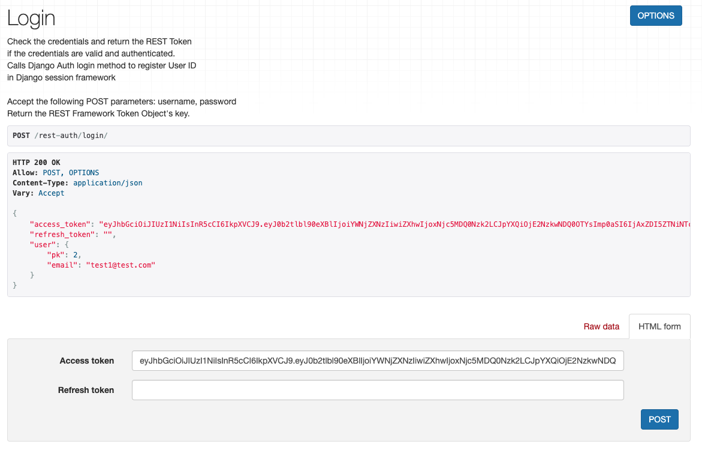

<br>

> [👮 _이전 포스팅_](https://soojiinleee.github.io/Django/drf-authentication(01)-dj-rest-auth-&-tokenauthentication/)

<br>

# Contents
   - [1. dj-rest-auth에서 JWT 사용하기](#1-dj-rest-auth에서-jwt-사용하기)
     - [세팅 파일에 (dj-rest-auth) JWT 설정 추가하기](#세팅-파일에--dj-rest-auth--jwt-설정-추가하기)
   - [2. simplejwt](#2-simplejwt)
     - [세팅 파일에 (djangorestframework-simplejwt) JWT 설정 추가하기](#세팅-파일에--djangorestframework-simplejwt--jwt-설정-추가하기)

<br>
<br>

# 1. dj-rest-auth에서 JWT 사용하기
- `Django`에서 `JWT`를 지원하는 `djangorestframework-simplejwt` 패키지를 통해 기본 Token 인증에서 `JWT`로 바꿀 수 있다.
- `djangorestframework-simplejwt` 설치 후에 `dj-rest-auth`의 `JWT` 설정을 마무리 하는 것이 좋다.

## 세팅 파일에 (dj-rest-auth) JWT 설정 추가하기
1. `REST_FRAMEWORK` 세팅 추가
    ```python
     REST_FRAMEWORK = {
       ...,
       'DEFAULT_AUTHENTICATION_CLASSES': (
           ...
           'dj_rest_auth.jwt_auth.JWTCookieAuthentication',
       )
       ...,
   }
    ```
   - `dj-rest-auth`에서 로그인, 로그아웃 등 엔드포인트에서 인증 확인하는 로직이 있으므로 추가한다.

<br>

2. `REST_AUTH` 설정 ( ✅ __제일 중요__ )
   
   다른 블로그를 봤을 때는 `REST_USE_JWT = TRUE`로 설정하면 된다고 했지만, 올해 2월 설정 방법이 바뀐 거 같다.
   어쨌든 공식 문서에 나와 있는 대로 아래와 같이 설정한다.
      ```python
      REST_AUTH = {
       ...
       'USE_JWT': True,
      }
      ```
   다른 설정을 제대로 했어도 `USE_JWT`를 설정하지 않으면, `dj-rest-auth`의 기본 인증 방식인 `Token`으로 진행된다.

<br>

3. `REST_AUTH` 추가 설정

   `dj-rest-auth` 공식문서에서 `Configuration` 중 `JWT` 관련 내용을 확인한 뒤 필요에 맞게 추가 설정을 하면 된다.
   ```python
   REST_AUTH = {
    ...,
    'JWT_AUTH_HTTPONLY': False,
   }
   ```
   - `JWT_AUTH_HTTPONLY` : `refresh_token`를 사용할 예정이라면, **False**로 설정을 바꿔야한다.
   - **True**로 설정되어 있다면 `refresh_token` 없이 아래와 같이 리턴된다.

   


### 참고
- [dj-rest-auth JWT Support](https://dj-rest-auth.readthedocs.io/en/latest/installation.html#json-web-token-jwt-support-optional)
- [dj-rest-auth Configuration](https://dj-rest-auth.readthedocs.io/en/latest/configuration.html)

<br>
<br>

# 2. SimpleJwt
- `JWT` 유효시간 설정 및 `blacklist` 등이 있어 보안 설정을 할 수 있는 라이브러리이다.

## 세팅 파일에 (djangorestframework-simplejwt) JWT 설정 추가하기
1. `REST_FRAMEWORK` 세팅 추가
   ```python
   REST_FRAMEWORK = {
    ...
    'DEFAULT_AUTHENTICATION_CLASSES': (
        ...
        'rest_framework_simplejwt.authentication.JWTAuthentication',
    )
    ...
   }
   ```

<br>

2. `INSTALLED_APPS` 추가
   ```python
   INSTALLED_APPS = [
    ...,
    'rest_framework_simplejwt',
    ...
   ]
   ```
<br>

3. `SIMPLE_JWT` 설정
   
   `SimpleJWT`의 `Settings` 에서 필요한 설정 내용 확인 후 추가하면 된다.
   <br>
   토큰 타입에 따라 유효기간 설정을 할 수 있으며, `access_token`과 `refresh_token`은 아래와 같이 설정 할 수 있다.
   ```python
   SIMPLE_JWT = {
       "ACCESS_TOKEN_LIFETIME": timedelta(minutes=5),
       "REFRESH_TOKEN_LIFETIME": timedelta(days=1),
   }
   ```
   `SIMPLE_JWT` 설정이 `dj-rest-auth`의 `LoginView` 등에서 사용된다. (자세한 내용은 [dj-rest-auth : views](https://github.com/iMerica/dj-rest-auth/blob/master/dj_rest_auth/views.py) 참조)

<br>

### 참고
- [SimpleJWT](https://django-rest-framework-simplejwt.readthedocs.io/en/latest/getting_started.html#installation)
- [SimpleJWT Settings](https://django-rest-framework-simplejwt.readthedocs.io/en/latest/settings.html)
- [Refresh Token과 Sliding Sessions를 활용한 JWT의 보안 전략](https://blog.ull.im/engineering/2019/02/07/jwt-strategy.html)<br>


<br>
<br>

> dj-rest-auth에서 JWT로 인증을 하면 외부 패키지인 SimpleJWT 이용하게 된다. dj-reat-auth에서 SimpleJWT 설정을 가져오는 경우가 있다.
> 각 github 레포에서 코드까지 확인 하는 것을 추천한다.
> <br>
> <br> From 완전 상관 없는 별개라고 생각했다가 삽질한 사람 🚧